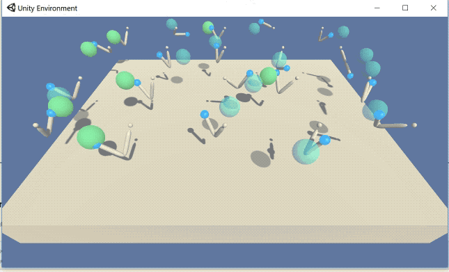

## Project Details

In this project we will attempt to train an agent to solve a task of reaching a particular target location using double jointed arm and.  A reward of +0.1 is provided for each step that the agent's hand is in the goal location. The target location slowly moves and the agent should try and keep the arm positioned within the target.

In the chosen environment, there are 20 agents acting in parallel, each with their own target location

This environment is implemented in Unity.

##### Rewards
The agent receives a reward of 0.1 for each step that the hand is in the goal location.

##### State
The state space consists of 33 dimensions. The state space represents position, rotation, angular velocities and velocity of the arm.

##### Actions
The action is a continuous space. The action is represented by four numbers which represent the torque that is applied to the joints. The values of each action must be in the range -1 to 1.

##### Solving the environment
The environment is considered solved if the average score is +30 over 100 consecutive episodes, for all 20 agents.

## Getting Started

##### Dependencies
If you have already set up an environment for Udacity's Deep Reinforcement Learning programme, then you should have all needed dependencies installed. If not head over to 

https://github.com/udacity/deep-reinforcement-learning#dependencies

and follow the instructions there

##### Project files
Once you've set up the environment, download all the files from this repository into a single folder, and you should be good to go

## Instructions

Navigate to the folder where you've downloaded the project files and run the command

`jupyter notebook Continuous_Control.ipynb`

Follow the instructions in the notebook. If you do run into some errors regarding the Unity environment, try restarting the kernel.

To jump straight to training the agent first run the code in sections 1 and 2, and then jump to section 4. Section 5 lets you view the performance of an already trained agent.