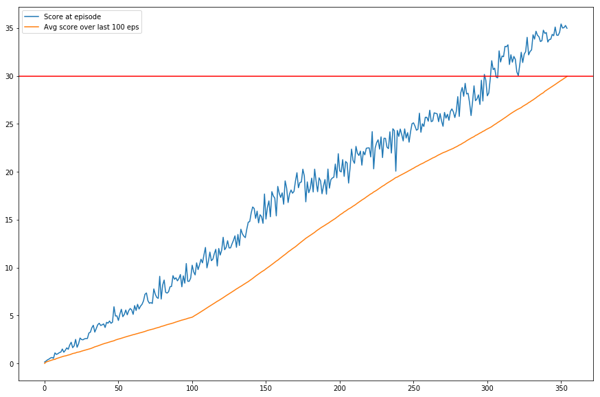

# PPO Network to solve the Unity Reacher environment

## Learning Algorithm

The algorithm used to create the agent is Proximal Policy Optimization ([Original PPO Paper](https://arxiv.org/abs/1707.06347))

PPO belongs to the family of policy gradient methods. Several tests show that it has performed well in various continuous control tasks, which makes it an ideal candidate for tackling the Reacher environment.

The main steps involved in PPO are

* Generate a set of trajectories using the current policy
* Optimize the network using a surrogate objective function
The 'surrogate' function here attempts to prevent updates that cause the policy to diverge too far from its current state. It does this by clipping the ratio between the estimated action probabilities of the old network compared to the new network
* Repeat until the environment is solved

The surrogate function also requires an estimate of the advantages of the policy. In this implementation, we used a value network to generate these advantage estimates. The surrogate function also has an 'entropy' coefficient that aids in exploration.

Thus the neural network actually consists of two components - the actor (which provides the policy) and the critic (which provides the value estimates)

The policy loss (which is essentially the clipped ratio multiplied by the advantages) and the value loss are both backpropagated through the network during the optimization step to update the weights of both networks.

### Parameters
The neural network used is a simple two-hidden layer network with ReLU activation. 

#### Actor network
This is a simple two-hidden layer network.

Here is the description of the network

* Hidden Layer 1 - 512 units, ReLU activation
* Hidden Layer 2 - 256 units, ReLU activation
* Output Layer - 4 units, tanh activation

The tanh function is used so that the output actions are in the range -1 to 1. These outputs are then fed through a normal distribution that lets us calculate the probabilties of each action.

#### Critic network

This is another simple two-hidden layer network
* Hidden Layer 1 - 512 units, ReLU activation
* Hidden Layer 2 - 256 units, ReLU activation
* Output Layer - 1 units, Linear activation

The output just has one unit since we're using it to estimate the value given a state.

Initially, the hidden layer sizes were set to 64 units. The networks performance didn't improve rapidly. Setting the layer sizes to 512 and 256 seemed to significantly speed up the learning process.

#### Other Parameters

The other parameters involved were
* The Adam optimizer was used with the learning rate set to 3e-4. Initially a value of 1e-4 was used, but it seemed to slow down the learning process.
* Gamma (Discount Factor) which was set to 0.99 which is a good default value to use
* Tau (GAE factor) was also set to 0.99. This is a factor that is used in estimating the advantage. It allows to blend advantages computed by looking 1,2,3...n steps forward
* Training epochs (5) - This is how many gradient optimizaiton steps we perform with a set of collected trajectories. Using more epochs results in more stable updates but at the cost of lower performance. 5 seemed to be a good number since we saw consistent improvement as the training went on
* Rollout Length (600) - This is the number of steps used to collect trajectories. 
* Clipping ratio (Epsilon) - This was set to 0.2. It acts as a limiter on how far the action probabilities of the current policy can diverge from the old policy. Most implementations of PPO suggest that 0.1 - 0.2 is a good range to start with, and we saw fairly stable improvements with 0.2 and decided not to change it.

## Plot of Rewards

The following plots shows the rewards at each episode, as well as the average over the last 100 episodes. The overall average of 20 agents over 100 episodes crossed 30 after training for 354 episodes. A red reference line marking a reward of 30 is shown as well.

## Ideas for Future Work

Other algorithms such as DDPG and TRPO could also be tried out to see if they perform any better. This survey paper [Hendersen et al.](https://arxiv.org/pdf/1709.06560.pdf) suggests that they too perform reasonably well on continuous control tasks.

The architecture used in this implementation is a simple two-hidden layer network with ReLU activation (both for the actor and critic). Experimenting with different architectures (such as shared weights between the actor and critic) and activation functions could possibly yield a further improvement in the agents performance. Furthermore it would also help to explore the effect of other parameters (such as Tau, or the clipping ratio) and see what effect they have.